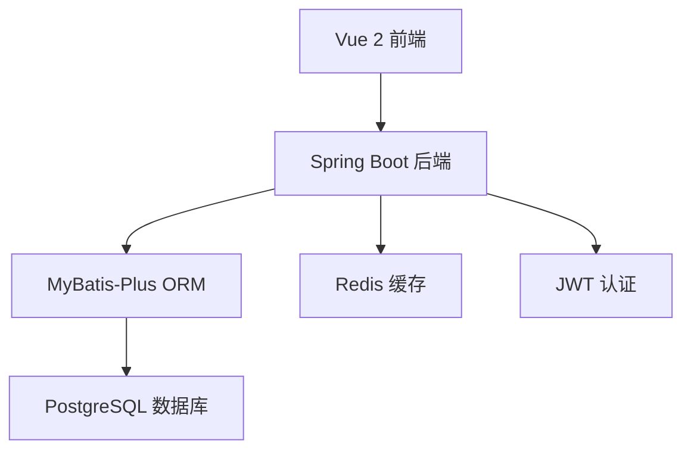
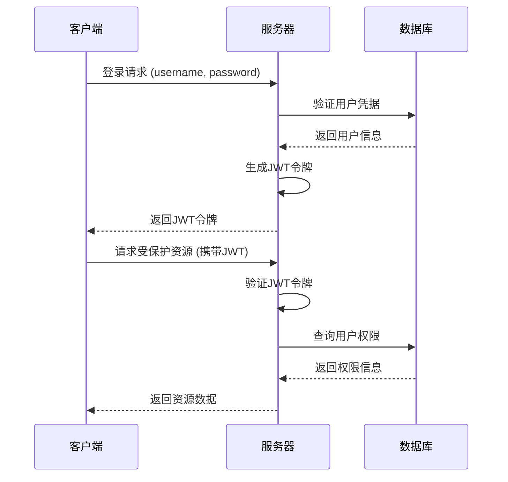
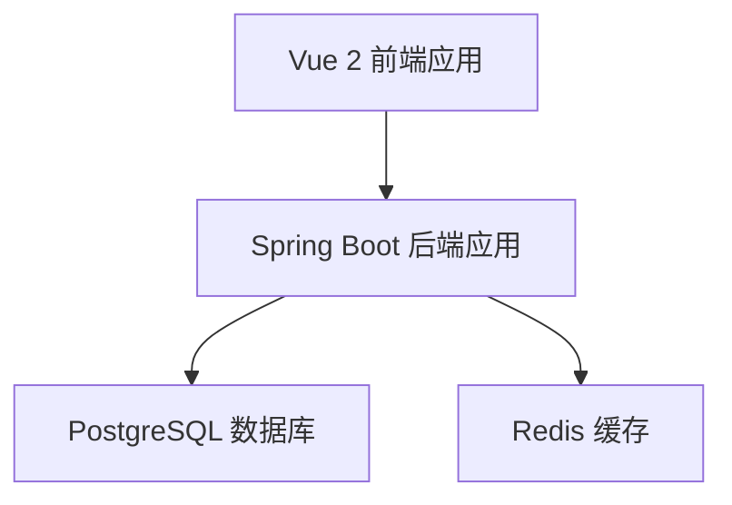

# 设计文档

## 概述

用户管理系统采用前后端分离架构，后端使用Spring Boot 2.7.x + MyBatis-Plus构建RESTful API，前端使用Vue 2构建单页应用。系统使用JWT进行身份认证，PostgreSQL作为数据存储，Maven作为构建工具。系统提供完整的用户生命周期管理功能，包括用户注册、登录、信息管理、状态控制和基于角色的权限管理。前后端放在不同的目录中，前端直接调用后端API而无需通过nginx，确保清晰的职责分离和可维护性。

**设计决策理由：**
- 选择Spring Boot 2.7.x确保与Java 8的兼容性和稳定性
- MyBatis-Plus提供强大的ORM功能和代码生成能力
- JWT无状态认证适合前后端分离架构
- PostgreSQL提供可靠的ACID事务支持，满足数据一致性要求

## 架构

### 整体架构



### 技术栈

**后端技术栈：**
- Java 8
- Spring Boot 2.7.x
- Spring Security
- MyBatis-Plus 3.5.x
- PostgreSQL 14+
- Redis (可选，用于缓存)
- Maven 3.6+
- JWT (JSON Web Token)

**前端技术栈：**
- Vue 2.7.x
- Vue Router
- Vuex
- Element UI
- Axios
- Webpack

## 组件和接口

### 后端组件结构

```
src/main/java/com/example/usermanagement/
├── config/          # 配置类
│   ├── SecurityConfig.java
│   ├── MyBatisPlusConfig.java
│   └── CorsConfig.java
├── controller/      # 控制器层
│   ├── AuthController.java
│   ├── UserController.java
│   └── RoleController.java
├── service/         # 服务层
│   ├── UserService.java
│   ├── AuthService.java
│   └── RoleService.java
├── mapper/          # 数据访问层
│   ├── UserMapper.java
│   └── RoleMapper.java
├── entity/          # 实体类
│   ├── User.java
│   ├── Role.java
│   └── UserRole.java
├── dto/             # 数据传输对象
│   ├── LoginRequest.java
│   ├── RegisterRequest.java
│   ├── UserResponse.java
│   └── PageResponse.java
├── security/        # 安全相关
│   ├── JwtAuthenticationFilter.java
│   ├── JwtTokenProvider.java
│   └── UserDetailsServiceImpl.java
└── exception/       # 异常处理
    ├── GlobalExceptionHandler.java
    └── BusinessException.java
```

### 前端组件结构

```
src/
├── components/      # 通用组件
│   ├── Layout/
│   ├── Header/
│   └── Sidebar/
├── views/           # 页面组件
│   ├── Login.vue
│   ├── Register.vue
│   ├── Dashboard.vue
│   ├── Profile.vue
│   ├── UserList.vue
│   └── RoleManagement.vue
├── router/          # 路由配置
│   └── index.js
├── store/           # Vuex状态管理
│   ├── modules/
│   │   ├── auth.js
│   │   └── user.js
│   └── index.js
├── api/             # API接口
│   ├── auth.js
│   ├── user.js
│   └── role.js
└── utils/           # 工具函数
    ├── request.js
    ├── auth.js
    └── validation.js
```

### RESTful API 接口设计

#### 认证接口
```
POST /api/auth/login          # 用户登录
POST /api/auth/register       # 用户注册
POST /api/auth/logout         # 用户登出
POST /api/auth/refresh        # 刷新令牌
```

#### 用户管理接口
```
GET    /api/users             # 获取用户列表（分页，支持搜索和筛选）
GET    /api/users/{id}        # 获取用户详情
PUT    /api/users/{id}        # 更新用户信息
DELETE /api/users/{id}        # 删除用户
PUT    /api/users/{id}/status # 更新用户状态
GET    /api/users/profile     # 获取当前用户信息
PUT    /api/users/profile     # 更新当前用户信息
PUT    /api/users/password    # 修改密码

# 查询参数支持：
# ?page=1&size=10&search=keyword&status=1&role=ADMIN
```

#### 角色管理接口
```
GET    /api/roles             # 获取角色列表
POST   /api/roles             # 创建角色
PUT    /api/roles/{id}        # 更新角色
DELETE /api/roles/{id}        # 删除角色
PUT    /api/users/{id}/roles  # 分配用户角色
```

## 数据模型

### 数据库表设计

#### 用户表 (users)
```sql
CREATE TABLE users (
    id BIGSERIAL PRIMARY KEY,
    username VARCHAR(50) UNIQUE NOT NULL,
    email VARCHAR(100) UNIQUE NOT NULL,
    password VARCHAR(255) NOT NULL,
    status INTEGER DEFAULT 1,  -- 1:启用, 0:禁用
    created_at TIMESTAMP DEFAULT CURRENT_TIMESTAMP,
    updated_at TIMESTAMP DEFAULT CURRENT_TIMESTAMP,
    last_login_at TIMESTAMP
);
```

#### 角色表 (roles)
```sql
CREATE TABLE roles (
    id BIGSERIAL PRIMARY KEY,
    name VARCHAR(50) UNIQUE NOT NULL,
    description VARCHAR(200),
    created_at TIMESTAMP DEFAULT CURRENT_TIMESTAMP,
    updated_at TIMESTAMP DEFAULT CURRENT_TIMESTAMP
);
```

#### 用户角色关联表 (user_roles)
```sql
CREATE TABLE user_roles (
    id BIGSERIAL PRIMARY KEY,
    user_id BIGINT NOT NULL,
    role_id BIGINT NOT NULL,
    created_at TIMESTAMP DEFAULT CURRENT_TIMESTAMP,
    FOREIGN KEY (user_id) REFERENCES users(id) ON DELETE CASCADE,
    FOREIGN KEY (role_id) REFERENCES roles(id) ON DELETE CASCADE,
    UNIQUE(user_id, role_id)
);
```

### 实体类设计

#### User 实体
```java
@Data
@TableName("users")
public class User {
    @TableId(type = IdType.AUTO)
    private Long id;
    
    private String username;
    private String email;
    private String password;
    private Integer status;
    
    @TableField("created_at")
    private LocalDateTime createdAt;
    
    @TableField("updated_at")
    private LocalDateTime updatedAt;
    
    @TableField("last_login_at")
    private LocalDateTime lastLoginAt;
    
    @TableField(exist = false)
    private List<Role> roles;
}
```

#### Role 实体
```java
@Data
@TableName("roles")
public class Role {
    @TableId(type = IdType.AUTO)
    private Long id;
    
    private String name;
    private String description;
    
    @TableField("created_at")
    private LocalDateTime createdAt;
    
    @TableField("updated_at")
    private LocalDateTime updatedAt;
}
```

## 业务逻辑设计

### 用户注册验证逻辑

**设计决策：** 采用多层验证策略确保数据完整性和用户体验

1. **前端验证：** 实时表单验证，提供即时反馈
2. **后端验证：** 服务层统一验证，确保数据安全性
3. **数据库约束：** 唯一性约束防止重复数据

**验证规则：**
- 用户名：非空，唯一性检查
- 邮箱：格式验证，唯一性检查
- 密码：长度至少8位，复杂度验证

**注册流程：**
1. 验证用户输入的有效性
2. 检查用户名和邮箱的唯一性
3. 创建用户账户并加密密码
4. 自动分配默认角色（USER）
5. 返回注册成功信息

**错误处理：**
- 用户名已存在：返回"用户名已存在"
- 邮箱已被注册：返回"邮箱已被注册"
- 密码长度不足：返回"密码长度至少8位"
- 邮箱格式无效：返回"邮箱格式无效"

### 用户登录认证逻辑

**设计决策：** JWT无状态认证机制，支持会话管理和安全控制

**登录流程：**
1. 验证用户名和密码
2. 检查用户账户状态（是否被禁用）
3. 生成JWT令牌包含用户信息和角色
4. 记录最后登录时间
5. 返回令牌和用户基本信息

**错误处理：**
- 用户名或密码错误：返回统一错误信息"用户名或密码错误"
- 账户被禁用：返回"账户已被禁用"
- JWT令牌过期：要求重新登录

**令牌管理：**
- 令牌有效期设置（如24小时）
- 支持令牌刷新机制
- 前端自动处理令牌过期情况

### 用户信息管理逻辑

**设计决策：** 分层权限控制，确保用户数据安全性

**个人信息管理：**
- 用户可查看和更新自己的基本信息（用户名、邮箱）
- 密码修改需要验证当前密码
- 邮箱更改需要验证唯一性
- 显示只读信息：创建时间、最后登录时间

**权限控制：**
- 用户只能修改自己的信息
- 管理员可以查看所有用户信息
- 敏感字段修改需要额外验证

### 用户列表管理逻辑

**设计决策：** 分页查询和多条件筛选，提升管理效率

**查询功能：**
- 支持分页显示用户列表
- 按用户名、邮箱进行模糊搜索
- 按状态（启用/禁用）和角色进行筛选
- 管理员专用功能，普通用户无权访问

**显示信息：**
- 用户基本信息：用户名、邮箱、状态、角色
- 时间信息：创建时间、最后登录时间
- 操作按钮：查看详情、编辑、启用/禁用

### 用户状态管理逻辑

**设计决策：** 软删除策略，保留用户数据完整性

- 状态字段：1(启用) / 0(禁用)
- 管理员不能禁用自己的账户（防止系统锁定）
- 禁用用户无法登录，但数据保留
- 状态变更需要记录操作日志
- 被禁用用户尝试登录时返回"账户已被禁用"错误

### 角色权限管理逻辑

**设计决策：** 基于角色的访问控制(RBAC)模型

- 默认角色：USER（普通用户）、ADMIN（管理员）
- 角色删除前检查是否有用户关联
- 支持用户多角色分配

**角色管理功能：**
- 创建新角色时验证角色名称唯一性
- 角色名称已存在时返回"角色名称已存在"错误
- 删除角色前检查是否有用户正在使用
- 有用户使用的角色无法删除，返回相应错误信息
- 权限验证失败时返回403权限错误

### 数据持久化设计

**设计决策：** 确保数据完整性和一致性

- 使用事务管理确保数据操作的原子性
- 自动创建数据库表结构（通过MyBatis-Plus）
- 连接池管理数据库连接
- 异常情况下自动回滚事务


## 错误处理

### 统一异常处理

```java
@RestControllerAdvice
public class GlobalExceptionHandler {
    
    @ExceptionHandler(BusinessException.class)
    public ResponseEntity<ErrorResponse> handleBusinessException(BusinessException e) {
        return ResponseEntity.badRequest()
            .body(new ErrorResponse(e.getCode(), e.getMessage()));
    }
    
    @ExceptionHandler(ValidationException.class)
    public ResponseEntity<ErrorResponse> handleValidationException(ValidationException e) {
        return ResponseEntity.badRequest()
            .body(new ErrorResponse("VALIDATION_ERROR", e.getMessage()));
    }
    
    @ExceptionHandler(AccessDeniedException.class)
    public ResponseEntity<ErrorResponse> handleAccessDeniedException(AccessDeniedException e) {
        return ResponseEntity.status(HttpStatus.FORBIDDEN)
            .body(new ErrorResponse("ACCESS_DENIED", "权限不足"));
    }
}
```

### 错误码定义

```java
public enum ErrorCode {
    USER_NOT_FOUND("USER_NOT_FOUND", "用户不存在"),
    USERNAME_EXISTS("USERNAME_EXISTS", "用户名已存在"),
    EMAIL_EXISTS("EMAIL_EXISTS", "邮箱已被注册"),
    INVALID_PASSWORD("INVALID_PASSWORD", "密码长度至少8位"),
    INVALID_EMAIL("INVALID_EMAIL", "邮箱格式无效"),
    ACCOUNT_DISABLED("ACCOUNT_DISABLED", "账户已被禁用"),
    INVALID_CREDENTIALS("INVALID_CREDENTIALS", "用户名或密码错误"),
    CANNOT_DISABLE_SELF("CANNOT_DISABLE_SELF", "不能禁用自己的账户"),
    ROLE_NOT_FOUND("ROLE_NOT_FOUND", "角色不存在"),
    ROLE_NAME_EXISTS("ROLE_NAME_EXISTS", "角色名称已存在"),
    CANNOT_DELETE_ROLE_IN_USE("CANNOT_DELETE_ROLE_IN_USE", "角色正在使用中，无法删除");
}
```

## 安全设计

### JWT 认证流程



### 权限控制

- 使用Spring Security进行权限控制
- 基于角色的访问控制(RBAC)
- JWT令牌包含用户ID和角色信息
- 前端根据用户角色显示/隐藏功能

### 密码安全

- 使用BCrypt进行密码加密
- 密码强度验证（至少8位，包含字母和数字）
- 登录失败次数限制（可选）

## 测试策略

### 单元测试

**后端测试：**
- Service层业务逻辑测试
- Controller层API接口测试
- Mapper层数据访问测试
- 使用JUnit 5 + Mockito
- 测试覆盖率目标：80%+

**前端测试：**
- 组件单元测试
- 工具函数测试
- 使用Jest + Vue Test Utils
- 测试覆盖率目标：70%+

### 集成测试

- 使用TestContainers进行数据库集成测试
- API接口集成测试
- 前后端联调测试

### 测试数据

```sql
-- 默认角色数据
INSERT INTO roles (name, description) VALUES 
('ADMIN', '管理员'),
('USER', '普通用户');

-- 测试用户数据
INSERT INTO users (username, email, password, status) VALUES 
('admin', 'admin@example.com', '$2a$10$...', 1),
('user1', 'user1@example.com', '$2a$10$...', 1);

-- 用户角色关联
INSERT INTO user_roles (user_id, role_id) VALUES 
(1, 1), -- admin用户分配管理员角色
(2, 2); -- user1用户分配普通用户角色
```

### 性能考虑

- 数据库索引优化（username, email字段）
- 分页查询优化
- Redis缓存用户会话信息（可选）
- 前端懒加载和虚拟滚动
- API响应数据压缩

### 部署架构

**设计决策：** 简化部署架构，前后端直接通信



**部署说明：**
- 前后端分别部署在不同目录
- 前端直接调用后端API，无需nginx代理
- 后端提供CORS配置支持跨域请求
- 数据库和缓存独立部署